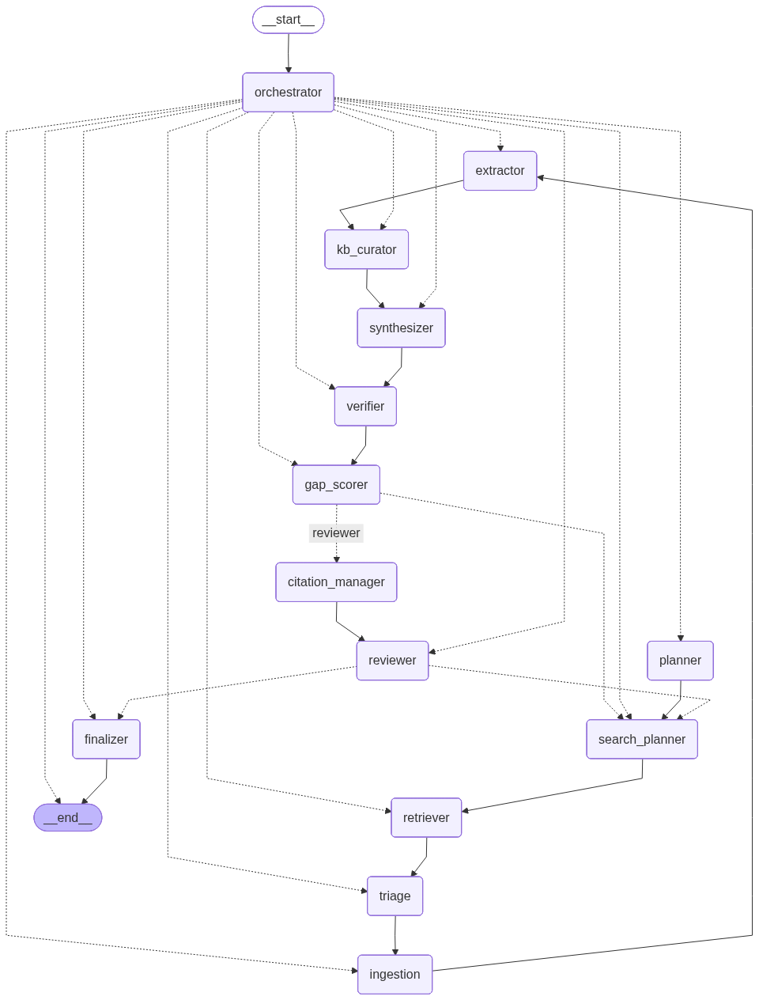

# Multilingual Multi-Agent Academic Research Assistant

A LangGraph-powered system that automates academic literature reviews and produces survey-style papers with strict grounding and traceable citations.


## Features

- **Multi-agent architecture**: 13 specialized agents (planner, retriever, extractor, synthesizer, reviewer, etc.)
- **Dynamic Knowledge Base**: Vector store + structured storage for papers, claims, entities, and relations
- **Grounded synthesis**: Every claim traces back to source evidence
- **Iterative refinement**: Gap scoring and ARR-style review drive quality improvements
- **Citation management**: Automatic BibTeX generation and citation normalization

## Workflow Architecture

<p align="center">
  
</p>

## Installation

```bash
# Clone the repository
git clone https://github.com/SanniM3/research-assistant.git
cd research-assistant

# Create virtual environment
python -m venv venv
source venv/bin/activate  # On Windows: venv\Scripts\activate

# Install dependencies
pip install -r requirements.txt
```

## Configuration

Create a `.env` file in the project root:

```env
OPENAI_API_KEY=your-openai-api-key
TAVILY_API_KEY=your-tavily-api-key

# Optional configuration
LLM_MODEL=gpt-4o
MAX_ITERATIONS=5
```

## Usage

### Web Interface (Streamlit)

```bash
streamlit run app.py
```

This opens a web UI where you can:
- Enter research topics
- Configure settings
- Watch progress in real-time
- Download the generated report

### Command Line

```bash
# Basic usage
python run.py "transformer architectures in NLP"

# With options
python run.py "quantum computing algorithms" \
  --max-iterations 3 \
  --output report.md \
  --verbose

# Stream progress updates
python run.py "climate change impacts" --stream
```

### Python API

```python
from src import ResearchWorkflow

# Create workflow
workflow = ResearchWorkflow()

# Run research
result = workflow.run(
    topic="multilingual reasoning in large language models",
    max_iterations=5
)

# Access the final report
print(result.final_report)

# Or with streaming
for state in workflow.run_with_streaming(topic="your topic"):
    print(f"Phase: {state.phase}, Papers: {len(state.papers_ingested)}")
```

### Using the ResearchAssistant Class

```python
from src.main import ResearchAssistant

assistant = ResearchAssistant(max_iterations=5)
result = assistant.research("deep learning for drug discovery")

# Save report
with open("survey.md", "w") as f:
    f.write(result.final_report)
```

## CLI Options

| Option | Description | Default |
|--------|-------------|---------|
| `topic` | Research topic (required) | - |
| `--constraints` | Additional focus areas | None |
| `--max-iterations` | Maximum research iterations | 5 |
| `--output` | Output file path | `report_<timestamp>.md` |
| `--output-language` | Output language code | `en` |
| `--verbose` | Enable debug logging | False |
| `--stream` | Stream progress updates | False |

## Project Structure

```
src/
├── agents/          # 13 specialized agents
├── config/          # Settings and configuration
├── graph/           # LangGraph workflow
├── models/          # Data models (Paper, Chunk, Claim, etc.)
├── storage/         # Vector store and knowledge base
├── tools/           # Search and document processing
└── utils/           # Logging utilities
```

## How It Works

1. **Planning**: Defines scope, research questions, and survey outline
2. **Search**: Generates queries for arXiv and web sources
3. **Retrieval**: Executes searches, deduplicates results
4. **Triage**: Screens papers by relevance
5. **Ingestion**: Fetches full text, chunks for retrieval
6. **Extraction**: Extracts claims, entities, and relations
7. **Synthesis**: Writes sections from claim bank with citations
8. **Verification**: Checks grounding, flags unsupported claims
9. **Gap Scoring**: Measures coverage, triggers iteration if needed
10. **Review**: ARR-style critique with actionable feedback
11. **Finalization**: Compiles report with bibliography

